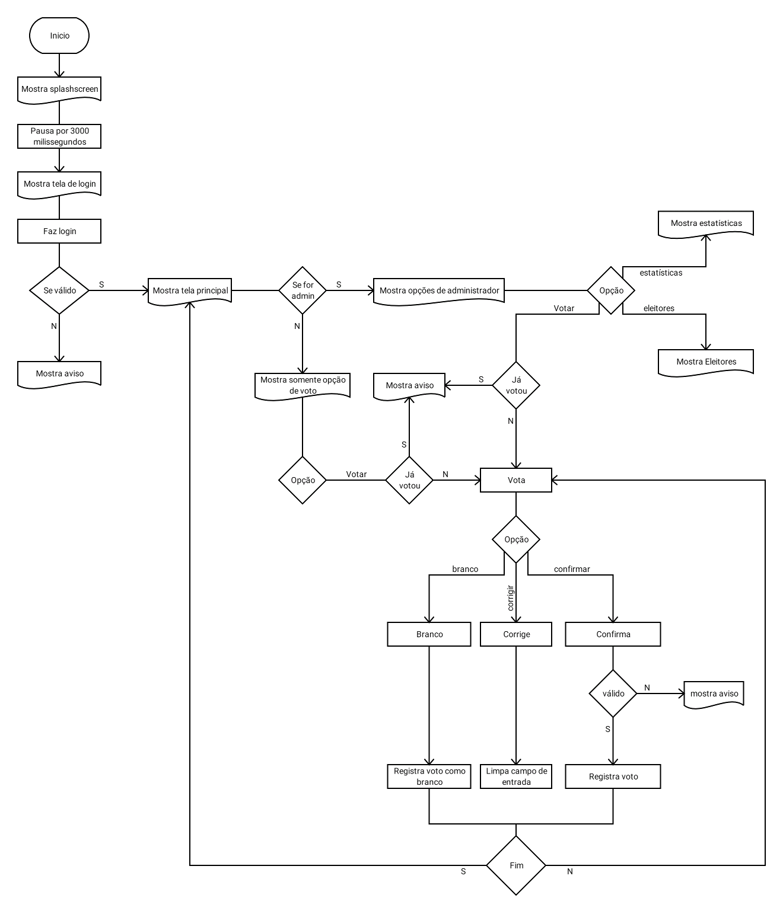
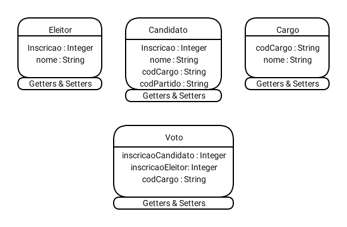
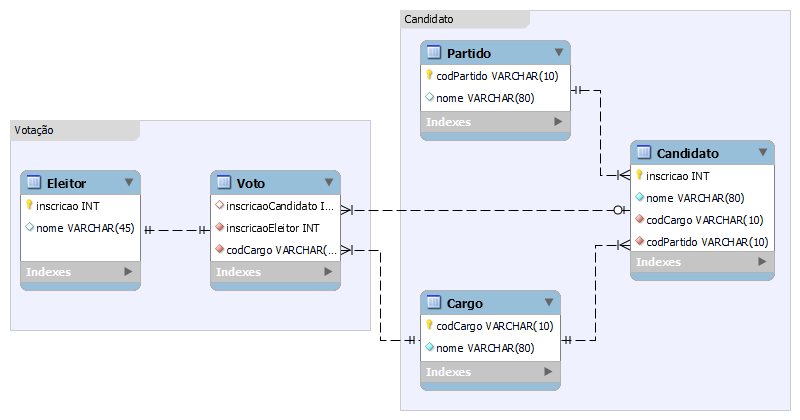

# VUrna

Projeto final do curso de desenvolvimento de sistemas do Senac.

[1. Fluxograma](#fluxograma)

[2. Diagrama de Classes](#diagrama-de-classes)

[3. Diagrama de Entidade Relacionamento](#DER)

[4. Mais Informações](#mais-info)

### Fluxograma

### Diagrama de classes

## DER

## Mais Info
Para mais informações acesse a pasta [docs](docs).
